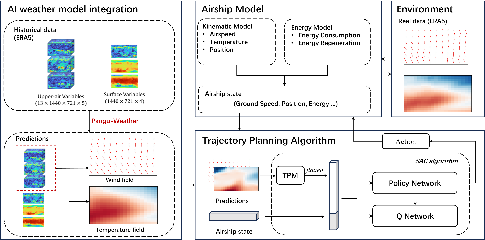

# Stratospheric Airship Trajectory Planning via Temporal Perception and Dual-Source Learning

This repository provides resources related to **TemT-SAC** and **Pangu-Weather**. It also includes information about the **ERA5 Dataset**, which serves as the foundational dataset for training and evaluation.

---

## 🌤️ TemT-SAC

### Description
TemT-SAC (Temporal-Spatial Attention Convolutional Network) is a state-of-the-art model designed for high-resolution, accurate short-term and medium-range weather forecasting. Built upon modern convolutional architectures and attention mechanisms, it captures complex spatiotemporal dependencies across multiple atmospheric variables.

### Figures



### Resources
- [Baidu Netdisk](https://pan.baidu.com/s/1xxxxxxx ) - Download pre-trained models and datasets *(Extraction Code: xxxx)*
Baidu Netdisk: https://pan.baidu.com/s/1U2R1KrnvInvzAtw29cwB5A Passward: iitx 
---

## 🌍 Pangu-Weather

### Description
[Pangu-Weather](https://github.com/198808xc/Pangu-Weather ) is a 3D high-resolution neural network model developed by Huawei Cloud for fast and accurate global weather forecasting. It achieves superior performance in predicting various meteorological variables over medium-range timeframes.

The model has been integrated into the European Centre for Medium-Range Weather Forecasts (ECMWF) operational suite and is publicly accessible for 10-day global forecasts.

### Figures


### Resources
- [Baidu Netdisk](https://pan.baidu.com/s/1xxxxxxx ) - Download pre-trained models and inference tools *(Extraction Code: xxxx)*
- [Official Repository](https://github.com/198808xc/Pangu-Weather )

---

## 📊 ERA5 Dataset

### Description
The **ERA5 dataset** from the Copernicus Climate Change Service provides global historical weather data at high spatial and temporal resolution. It includes surface and upper-air meteorological variables, serving as the backbone for training and validating AI-based forecasting models like Pangu-Weather and TemT-SAC.

### Figures


### Resources
- [Baidu Netdisk](https://pan.baidu.com/s/1xxxxxxx ) - Preprocessed ERA5 samples *(Extraction Code: xxxx)*
- [Official Website](https://cds.climate.copernicus.eu/datasets/reanalysis-era5-pressure-levels )

---

## 📄 License

### Pangu-Weather
The trained parameters of Pangu-Weather are distributed under the **BY-NC-SA 4.0 license**. Commercial use of these models is strictly prohibited.

For more details, please refer to the [license terms](https://creativecommons.org/licenses/by-nc-sa/4.0/ ).

### TemT-SAC & Custom Models
Unless otherwise stated, all custom models and tools provided in this repository are released under the **MIT License** for non-commercial research purposes.

---

## 📚 Citation

If you use any of the models or datasets in your research, please cite the following works:

### Pangu-Weather (Nature Paper)
```bibtex
@article{bi2023accurate,
  title={Accurate medium-range global weather forecasting with 3D neural networks},
  author={Bi, Kaifeng and Xie, Lingxi and Zhang, Hengheng and Chen, Xin and Gu, Xiaotao and Tian, Qi},
  journal={Nature},
  volume={619},
  number={7970},
  pages={533--538},
  year={2023},
  publisher={Nature Publishing Group}
}
